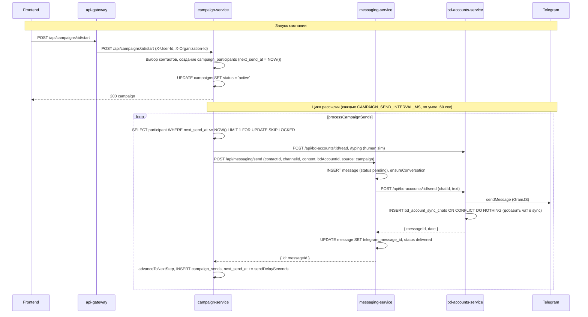
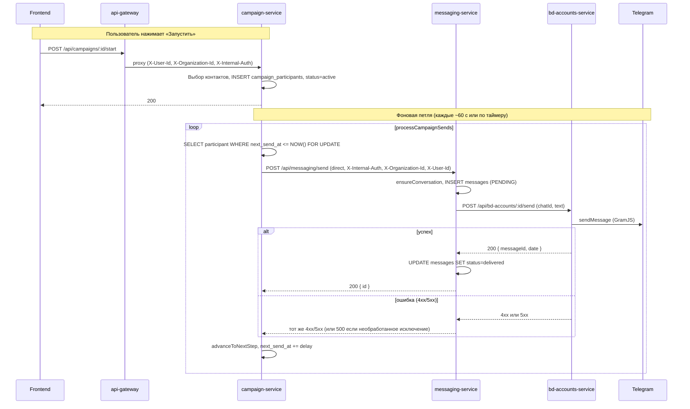

# Флоу рассылки кампании и разбор логов

## 0. Почему «участники пропадают» при запуске (127 → 0)

**Симптом:** В аудитории выбрано 127 контактов, у всех в колонке «Telegram ID» стоит «—». После нажатия «Запустить» кампания переходит в «Запущена», но на вкладке «Участники» — «Участников пока нет».

**Причина:**

1. **До старта** вкладка «Участники» показывает не запись из БД, а **выбранную аудиторию**: `campaign.target_audience.contactIds` (127 id). Для черновика/паузы фронт берёт `campaign.selected_contacts` и рисует по ним таблицу — поэтому видно 127 строк. Колонка «Telegram ID» пустая, потому что у этих контактов в БД действительно нет `telegram_id` (или он пустой).

2. **При старте** бэкенд ([execution.ts](services/campaign-service/src/routes/execution.ts)) делает выборку контактов **с обязательным условием** `c.telegram_id IS NOT NULL AND c.telegram_id != ''` (строки 61–65, 70–72). То есть в участники попадают только контакты, у которых уже есть Telegram ID.

3. Если ни у одного из 127 выбранных контактов нет `telegram_id`, запрос возвращает **0 строк**. В цикле ни один контакт не добавляется в `campaign_participants` (`insertedCount = 0`).

4. Ошибка при этом **не возвращается**: проверка `if (contacts.length > 0 && insertedCount === 0)` не срабатывает, потому что `contacts.length === 0` (пустой результат выборки). Статус кампании всё равно переводится в `active`, ответ 200.

5. **После старта** вкладка «Участники» переключается на режим «запущенной» кампании и показывает уже реальных участников из `GET /api/campaigns/:id/participants` (таблица `campaign_participants`). Там 0 записей → «Участников пока нет».

**Итог:** Участники не «удаляются» — они просто **не создаются**, потому что ни один из 127 контактов не прошёл фильтр по `telegram_id`. Кампания при этом успешно переводится в «Запущена» без явной ошибки.

**Что сделать:**

- **Обогащение перед стартом:** включить «Обогащать контакты перед запуском» и указать BD-аккаунт; перед вызовом старта вызывается `enrich-contacts` (по username подтягивается telegram_id). После обогащения контакты получат `telegram_id` и смогут стать участниками.
- **Валидация на бэкенде:** при старте, если в аудитории явно переданы `contactIds` (массив не пустой), но после фильтра по `telegram_id` не осталось ни одного контакта — возвращать 400 с текстом вроде: «Ни один из выбранных контактов не имеет Telegram ID. Добавьте Telegram ID контактам или включите обогащение перед запуском».
- **Фронт:** при выбранных контактах без Telegram ID показывать предупреждение перед запуском или блокировать кнопку «Запустить» с подсказкой про обогащение/добавление Telegram ID.

---

## 1. Флоу от фронта до отправки сообщения



**Участники:**
- **Frontend:** кнопка «Запустить» → `startCampaign(id)` → `POST /api/campaigns/${id}/start`.
- **api-gateway:** проксирует на campaign-service (timeout 30s).
- **campaign-service:** 
  - `POST /:id/start` создаёт участников (контакты с telegram_id + выбранный BD-аккаунт), ставит `next_send_at = now`, переводит кампанию в `active`.
  - Воркер `campaign-loop.ts` по таймеру выбирает участников с `next_send_at <= NOW()`, вызывает messaging send, обновляет шаг и следующую отправку.
- **messaging-service:** создаёт запись в `messages`, дергает bd-accounts `POST /:id/send`.
- **bd-accounts-service:** отправляет в Telegram через GramJS, при успехе добавляет чат в `bd_account_sync_chats` (если ещё не было).

Важно: при **отправке** через `POST /:id/send` чат в sync list не проверяется — отправка идёт, после неё чат добавляется в sync. Проверка sync list в bd-accounts используется только для **входящих/исходящих апдейтов от Telegram** (сохранять ли сообщение в БД и слать ли события на фронт).

---

## 2. Что видно по твоим логам

### 2.1. delete-by-telegram по-прежнему 500

В логах после перезапуска:
```text
"messaging-service call failed, retrying" ... "POST /internal/messages/delete-by-telegram returned 500"
"messaging-service call failed after 3 attempts"
"UpdateDeleteChannelMessages handler error for dc641377-..."
"messaging-service circuit breaker tripped"
```

В коде уже стоит фикс (varchar vs bigint): в `services/messaging-service/src/routes/internal.ts` используется `ANY($3::text[])` и `telegramMessageIds.map(String)`. Если на проде всё ещё 500, значит на проде крутится **старый образ без этого фикса**. Нужна именно **сборка нового образа и деплой** messaging-service (не только перезапуск контейнеров).

### 2.2. «Chat not in sync list, skipping message»

Это логи bd-accounts при обработке апдейтов от Telegram (UpdateShortMessage, UpdateNewChannelMessage и т.д.): пришло событие «сообщение отправлено/получено», но чат не в `bd_account_sync_chats`, поэтому мы **не сохраняем** это сообщение в БД и не шлём событие на фронт. На саму **отправку** кампании это не влияет: отправка идёт через `POST /:id/send`, который sync list при отправке не проверяет и после успешной отправки сам добавляет чат в sync.

То есть эти сообщения — про то, что часть чатов (куда уже пишут с телефона/клиента) не выбраны при синхронизации в приложении; для рассылки кампании они не блокирующие.

### 2.3. В логах нет campaign-service

В присланном срезе есть только bd-accounts-service. Чтобы понять, почему уходят только 2–3 сообщения, нужны логи **campaign-service** и **messaging-service** в момент запуска кампании и следующие 5–10 минут.

---

## 3. Что проверить и какие логи собрать

### 3.1. Задеплоить фикс delete-by-telegram

- Убедиться, что в образе messaging-service попал коммит с заменой `bigint[]` на `text[]` и `telegramMessageIds.map(String)` в `internal.ts`.
- Пересобрать образ и задеплоить messaging-service, затем перезапустить (или сделать полный деплой).

После этого 500 и срабатывание circuit breaker на delete-by-telegram должны пропасть.

### 3.2. Логи для разбора «отправляются только 2–3 сообщения»

Собрать за один запуск кампании (с момента нажатия «Запустить» и 5–10 минут после):

1. **campaign-service**
   - Ошибки и предупреждения (level: error, warn).
   - Любые строки с `processCampaignSends`, `Campaign send`, `sendMessageWithRetry`, `Campaign participant`, `Campaign iteration error`, `Campaign send worker error`.
   - Запросы к campaign API: `POST /api/campaigns/:id/start`, если видишь в логах.

2. **messaging-service**
   - `POST /api/messaging/send` (или аналог в логах): статус 200/4xx/5xx, время ответа.
   - Ошибки при отправке в Telegram (если логируются).

3. **bd-accounts-service**
   - `POST /api/bd-accounts/:id/send`: успех/ошибка, таймауты.
   - Сообщения про «not connected» или «account is not connected» в момент рассылки.

4. **api-gateway** (по желанию)
   - 4xx/5xx на `POST /api/campaigns/:id/start` и на запросах к messaging/campaign, если прокси логирует такие ответы.

### 3.3. Проверка в БД (если есть доступ)

Для кампании, где «залипают» участники:

- Выборка участников с `status IN ('pending','sent')` и `next_send_at <= NOW()` — должны подхватываться воркером.
- У части участников есть ли `status = 'failed'` и что в `metadata` (текст ошибки).
- Проверить, что у кампании `status = 'active'`.

Это покажет, не помечаются ли участники как failed из-за ошибки отправки и не «откладываются» ли они из-за лимитов/расписания.

---

## 4. Кратко

| Проблема | Причина | Действие |
|----------|--------|----------|
| 500 delete-by-telegram, circuit breaker | На проде старый образ messaging-service (до фикса varchar/bigint) | Пересобрать и задеплоить messaging-service с текущим кодом |
| «Chat not in sync list» | Обычная работа: не все чаты в sync; только влияет на сохранение апдейтов, не на отправку | Можно игнорировать для рассылки |
| Отправляются только 2–3 сообщения | По текущим логам не видно | Включить/собрать логи campaign-service и messaging-service при запуске кампании; при необходимости — точечное логирование в campaign-loop и проверка БД участников |

После деплоя фикса и при наличии логов campaign-service + messaging-service за один запуск можно однозначно сказать, на каком шаге (выбор участника, вызов send, ответ bd-accounts, лимиты и т.д.) рассылка обрывается.

---

## 5. Почему чаты «то исчезают, то появляются» (раздел «Сообщения»)

**Симптом:** В разделе «Сообщения» список чатов иногда пустой («Нет чатов»), после обновления или через время чаты снова отображаются.

**Возможные причины:**

1. **Ошибки от bd-accounts при запросе списка sync-chats**  
   Загрузка чатов идёт так: фронт → api-gateway → messaging-service → **bd-accounts-service** `GET /internal/sync-chats?bdAccountId=...`. Если bd-accounts возвращает 4xx/5xx (таймаут, 401 из-за неверного `INTERNAL_AUTH_SECRET`, 500 при сбое БД и т.д.), messaging-service раньше превращал это в 500 для клиента, фронт показывал пустой список. После фикса ошибка от bd-accounts пробрасывается с тем же статусом и телом — в ответе и логах будет видна реальная причина.

2. **Circuit breaker в messaging-service**  
   При повторных сбоях вызовов к bd-accounts (например, таймауты или 500) circuit breaker в `ServiceHttpClient` открывается и какое-то время все запросы к bd-accounts отклоняются с 503. Запрос чатов тогда падает → «Нет чатов». После сброса breaker’а запросы снова проходят → чаты появляются.

3. **Параметр `channel`**  
   Если в запросе приходит `channel=tg` вместо `channel=telegram`, бэкенд раньше мог возвращать пустой список (ветка «только telegram»). В коде добавлена нормализация: `tg` приводится к `telegram`, поведение единое.

4. **Порядок загрузки на фронте**  
   Запрос чатов уходит с `bdAccountId: selectedAccountId`. Если первый запрос ушёл до выбора аккаунта или с пустым `selectedAccountId`, бэкенд отдаёт список по default-ветке (чаты из `messages` + sync), который может быть пустым. После выбора аккаунта и повторного запроса приходит список по sync-chats — чаты «появляются». Это не баг, а смена контекста (без аккаунта / с аккаунтом).

**Что проверить при нестабильности:**

- Логи **messaging-service** в момент запроса `GET /api/messaging/chats`: есть ли 4xx/5xx от bd-accounts, таймауты, сообщения про circuit breaker.
- Логи **bd-accounts-service** на `GET /internal/sync-chats`: 200 или ошибка, время ответа.
- Одинаковый ли **INTERNAL_AUTH_SECRET** у api-gateway, messaging-service и bd-accounts-service (при несовпадении bd-accounts вернёт 401, чаты не загрузятся).
- В ответе фронта на запрос чатов после фикса: при ошибке будет не только 500, а реальный статус (400/401/404/502/503) и сообщение от bd-accounts — по ним можно точно понять причину.

---

## 6. Связь с аудитом и валидацией (почему раньше такого не было)

После внедрения правил по аудиту и валидации могли появиться или ужесточиться проверки, из‑за которых загрузка чатов стала «то работает, то нет».

**Цепочка запроса чатов:**  
Фронт → **api-gateway** (JWT → `req.user`, добавляет заголовки) → **messaging-service** (internalAuth + extractUser) → **bd-accounts** `GET /internal/sync-chats` (проверяет X-Internal-Auth и X-Organization-Id).

**Что могло измениться и дать нестабильность:**

1. **INTERNAL_AUTH_SECRET**  
   В production все бэкенды требуют один и тот же секрет. Если у api-gateway, messaging-service и bd-accounts он разный или где‑то не задан, вызов messaging → bd-accounts даёт 401. Раньше проверка могла быть мягче или отсутствовать.

2. **Обязательный X-Organization-Id во внутреннем API bd-accounts**  
   В `bd-accounts-service` роут `/internal/sync-chats` явно требует заголовок `X-Organization-Id`; при отсутствии или пустом значении после `trim()` возвращается 400. Если эту проверку добавили/ужесточили при аудите, запросы без корректного org начали падать (чаты не грузятся).

3. **Gateway передаёт заголовки только при полном req.user**  
   В api-gateway заголовки `X-User-Id` и `X-Organization-Id` ставятся только если есть и `user.id`, и `user.organizationId`. Если по какой‑то причине `organizationId` пустой (например, старый JWT или баг в выдаче токена), заголовок не уходит → в messaging `req.user.organizationId` пустой → bd-accounts отвечает 400 → чаты пустые.

4. **Раньше ошибки от bd-accounts превращались в 500**  
   Любой 4xx/5xx от bd-accounts в messaging приводил к общему 500. Не было видно, что именно вернул bd-accounts (400 из‑за org, 401 из‑за секрета и т.д.). После фикса реальный статус и тело пробрасываются — по ним видно, что именно «не учли» (например, пустой org или неверный секрет).

**Что проверить после аудита/валидации:**

- Один и тот же **INTERNAL_AUTH_SECRET** у api-gateway, messaging-service и bd-accounts-service в том же окружении.
- В **JWT** всегда есть валидный `organizationId` (не пустая строка и не только пробелы); при необходимости — нормализация/валидация при выдаче токена.
- При 400 на загрузке чатов смотреть тело ответа: сообщение вроде «X-Organization-Id required» или «Account not found» укажет на пропущенную передачу org или tenant-проверку.

---

## 7. Проверенные и усиленные условия (аудит/валидация)

Проверено по коду и при необходимости усилено:

| Условие | Где | Статус |
|--------|-----|--------|
| **INTERNAL_AUTH_SECRET** один и тот же у gateway и всех бэкендов | api-gateway/config.ts, service-core/service-app.ts, docker-compose | В production gateway и сервисы падают при старте, если секрет не задан или равен дефолту. Значение задаётся через env (INTERNAL_AUTH_SECRET); одинаковость — ответственность деплоя. |
| **X-Internal-Auth** передаётся при проксировании | api-gateway/proxy-helpers: addInternalAuthToProxyReq | Все createAuthProxy и bdAccountsProxy вызывают addInternalAuthToProxyReq. Секрет берётся из config (env). |
| **X-Organization-Id** передаётся только при валидном org | api-gateway/proxy-helpers: addAuthHeadersToProxyReq | Заголовки User-Id и Organization-Id ставятся только если оба значения после **trim()** непустые. |
| **JWT: userId и organizationId не пустые** | api-gateway/auth.ts | Перед установкой req.user значения **trim()**; если после trim пусто — 401 «Invalid token payload». |
| **Бэкенды: org из заголовка нормализован** | service-core/middleware: extractUser | id и organizationId из заголовков приводятся к **trim()**, пустое остаётся ''. |
| **GET /chats не дергает bd-accounts без org** | messaging-service/routes/chats.ts | В начале обработчика: если orgId после trim пустой — **400 «Organization context required»**, вызов bd-accounts не выполняется. |
| **Внутренние API требуют X-Organization-Id** | bd-accounts internal, messaging internal, pipeline internal | Проверка наличия и непустоты (в т.ч. после trim) уже была; при отсутствии — 400 с явным текстом. |

Итог: передача org и внутреннего секрета приведена к единым правилам (trim, проверка непустоты, явные 400/401 при нарушении). Одинаковое значение INTERNAL_AUTH_SECRET в одном окружении по-прежнему нужно задавать в конфиге деплоя (env).

---

## 8. Circuit breaker и «0 отправленных» при рассылке

**Симптом:** В логах campaign-service: сначала `messaging-service POST /api/messaging/send returned 500`, затем `messaging-service circuit breaker OPEN — request rejected`, все участники падают с «Campaign send failed after retries», 0 сообщений отправлено.

**Причина:** campaign-service дергает messaging-service через `ServiceHttpClient`. При нескольких подряд 5xx (или таймаутах) срабатывает circuit breaker: дальнейшие запросы к messaging не отправляются, сразу отклоняются. Цепочка: **campaign → messaging → bd-accounts**; если bd-accounts возвращал 500 (например, необработанное исключение при отправке в Telegram), messaging отдавал 500 campaign’у → circuit открывался → рассылка останавливалась.

**Что сделано:**

1. **bd-accounts POST /:id/send**  
   Все ошибки отправки в Telegram обрабатываются в `try/catch`: «клиентские» (PEER_ID_INVALID, USERNAME_NOT_OCCUPIED и т.п.) → **400**; остальные → **502** с сообщением (логируем и больше не пробрасываем исключение). Исключения из GramJS больше не превращаются в 500 на уровне сервиса.

2. **Проверка по коду ошибки**  
   Учтён не только текст, но и `getErrorCode()` (например, RPC code USERNAME_NOT_OCCUPIED), чтобы чаще отдавать 400 для «чат/пользователь не найден».

3. **messaging-service POST /send**  
   При ошибке вызова bd-accounts возвращается статус downstream: 4xx → тот же 4xx клиенту (campaign); 5xx → тот же 5xx (502/503), а не общий 500.

**Итог:** Ошибки «user/chat not found» дают 400 → campaign не считает их сбоем для circuit breaker; остальные сбои отправки дают 502 с понятным сообщением. После деплоя bd-accounts и messaging при повторной рассылке в логах будет видно либо 400 (неверный получатель), либо 502 (ошибка Telegram/сети). Чтобы circuit снова закрылся после открытия, нужно либо подождать сброса (по умолчанию 30 с), либо перезапустить campaign-service.

---

## 9. Полный флоу рассылки и диагностика «POST /send returned 500»

**Цепочка от кнопки «Запустить» до отправки в Telegram:**



**Почему в логах «messaging-service POST /api/messaging/send returned 500»:**

500 клиенту (campaign) отдаёт **только** messaging-service. Возможные источники:

1. **messaging-service получил 5xx от bd-accounts**  
   Тогда мы пробрасываем этот статус (после правок — 502). Если правки не задеплоены, раньше мог уходить общий 500.

2. **В bd-accounts при отправке в Telegram выбросилось необработанное исключение**  
   GramJS или сеть кидают ошибку, которая не попала в `catch` в `POST /:id/send` — тогда bd-accounts отдаёт 500. После правок все такие ошибки ловятся и отдаётся 502 с сообщением.

3. **Исключение внутри messaging до/после вызова bd-accounts**  
   Например: падение на `ensureConversation`, на `pool.query`, или при разборе ответа. Тогда глобальный обработчик в messaging возвращает 500.

**Что сделать по шагам:**

1. **Задеплоить последние правки**  
   - **bd-accounts-service:** в `POST /:id/send` не пробрасывать исключения из `sendMessage`/`sendFile`; клиентские ошибки → 400, остальные → 502 с логом.  
   - **messaging-service:** при 5xx от bd-accounts отдавать тот же статус (502/503) клиенту, а не общий 500.

2. **Взять логи в момент первого 500**  
   В твоих логах первый сбой около **08:37:55** (retry 1). Нужно за тот же интервал (08:37:54–08:37:59):
   - **messaging-service:** `docker logs getsale-crm-messaging-service --since "2026-03-19T08:37:50" --until "2026-03-19T08:38:05" 2>&1`  
   - **bd-accounts-service:** `docker logs getsale-crm-bd-accounts-service --since "2026-03-19T08:37:50" --until "2026-03-19T08:38:05" 2>&1`  
   В messaging ищи строки с `POST /api/messaging/send`, `Error sending Telegram message`, `Unhandled error`. В bd-accounts — строки с `send`, `Telegram send failed`, или стек исключения.

3. **Проверить, что campaign передаёт контекст**  
   В campaign-loop при вызове `messagingClient.post` передаётся `{ userId: systemUserId, organizationId: row.organization_id }`. Если `row.organization_id` пустой или не UUID, в messaging или БД может падать запрос. В логах campaign при первом падении можно проверить participantId и по нему в БД посмотреть `organization_id` участника.

После деплоя правок и при следующем запуске рассылки: при «user/chat not found» должен приходить **400** (circuit не откроется), при прочих сбоях Telegram — **502** с текстом в теле ответа и в логах bd-accounts.

**Дополнительно (по логам bd-accounts):** если в логах видно `PEER_FLOOD` или `INPUT_USER_DEACTIVATED`:
- **PEER_FLOOD** — лимит Telegram на число сообщений новым пользователям; bd-accounts отдаёт **429** (rate limit). Campaign-service при 429 не переводит участника в failed: выставляет `next_send_at` на отложенное время (env `CAMPAIGN_429_RETRY_AFTER_MINUTES`, по умолчанию 30 мин), чтобы рассылка повторила попытку позже. При прочих сбоях после ретраев участник помечается failed, рассылка идёт дальше по остальным.
- **INPUT_USER_DEACTIVATED** — аккаунт получателя деактивирован в Telegram; bd-accounts отдаёт **400**, участник помечается failed, circuit не открывается.

**Проброс причины ошибки и логи:**
- messaging-service при 4xx/5xx от bd-accounts отдаёт клиенту текст из тела ответа (например «Telegram rate limit (PEER_FLOOD)...») в полях `error`/`message`, а не только «bd-accounts-service ... returned 429».
- campaign-service в логах «Campaign send failed after retries» и в `campaign_participants.metadata.lastError` сохраняет эту реальную причину (PEER_FLOOD и т.д.). При 429 в логах пишется «Campaign send rate limited (429), deferred retry» с полем `reason`.
