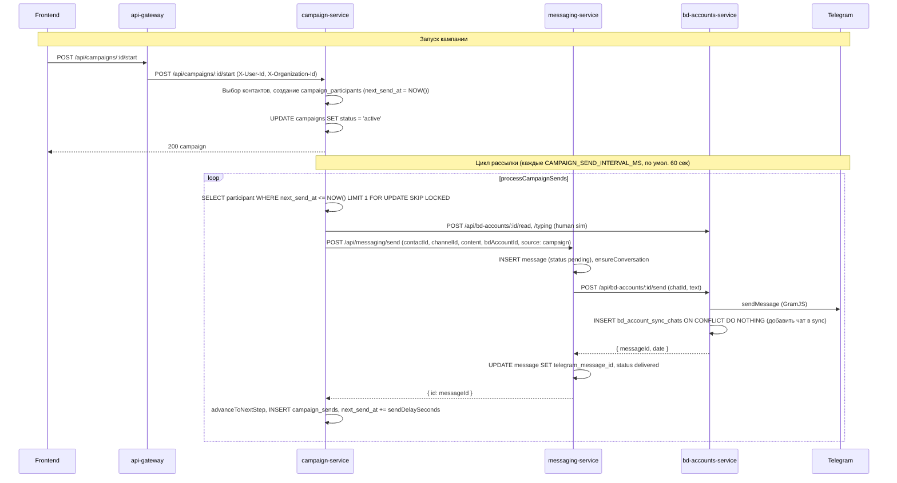

# Флоу рассылки кампании и разбор логов

## 0. Почему «участники пропадают» при запуске (127 → 0)

**Симптом:** В аудитории выбрано 127 контактов, у всех в колонке «Telegram ID» стоит «—». После нажатия «Запустить» кампания переходит в «Запущена», но на вкладке «Участники» — «Участников пока нет».

**Причина:**

1. **До старта** вкладка «Участники» показывает не запись из БД, а **выбранную аудиторию**: `campaign.target_audience.contactIds` (127 id). Для черновика/паузы фронт берёт `campaign.selected_contacts` и рисует по ним таблицу — поэтому видно 127 строк. Колонка «Telegram ID» пустая, потому что у этих контактов в БД действительно нет `telegram_id` (или он пустой).

2. **При старте** бэкенд ([execution.ts](services/campaign-service/src/routes/execution.ts)) делает выборку контактов **с обязательным условием** `c.telegram_id IS NOT NULL AND c.telegram_id != ''` (строки 61–65, 70–72). То есть в участники попадают только контакты, у которых уже есть Telegram ID.

3. Если ни у одного из 127 выбранных контактов нет `telegram_id`, запрос возвращает **0 строк**. В цикле ни один контакт не добавляется в `campaign_participants` (`insertedCount = 0`).

4. Ошибка при этом **не возвращается**: проверка `if (contacts.length > 0 && insertedCount === 0)` не срабатывает, потому что `contacts.length === 0` (пустой результат выборки). Статус кампании всё равно переводится в `active`, ответ 200.

5. **После старта** вкладка «Участники» переключается на режим «запущенной» кампании и показывает уже реальных участников из `GET /api/campaigns/:id/participants` (таблица `campaign_participants`). Там 0 записей → «Участников пока нет».

**Итог:** Участники не «удаляются» — они просто **не создаются**, потому что ни один из 127 контактов не прошёл фильтр по `telegram_id`. Кампания при этом успешно переводится в «Запущена» без явной ошибки.

**Что сделать:**

- **Обогащение перед стартом:** включить «Обогащать контакты перед запуском» и указать BD-аккаунт; перед вызовом старта вызывается `enrich-contacts` (по username подтягивается telegram_id). После обогащения контакты получат `telegram_id` и смогут стать участниками.
- **Валидация на бэкенде:** при старте, если в аудитории явно переданы `contactIds` (массив не пустой), но после фильтра по `telegram_id` не осталось ни одного контакта — возвращать 400 с текстом вроде: «Ни один из выбранных контактов не имеет Telegram ID. Добавьте Telegram ID контактам или включите обогащение перед запуском».
- **Фронт:** при выбранных контактах без Telegram ID показывать предупреждение перед запуском или блокировать кнопку «Запустить» с подсказкой про обогащение/добавление Telegram ID.

---

## 1. Флоу от фронта до отправки сообщения



**Участники:**
- **Frontend:** кнопка «Запустить» → `startCampaign(id)` → `POST /api/campaigns/${id}/start`.
- **api-gateway:** проксирует на campaign-service (timeout 30s).
- **campaign-service:** 
  - `POST /:id/start` создаёт участников (контакты с telegram_id + выбранный BD-аккаунт), ставит `next_send_at = now`, переводит кампанию в `active`.
  - Воркер `campaign-loop.ts` по таймеру выбирает участников с `next_send_at <= NOW()`, вызывает messaging send, обновляет шаг и следующую отправку.
- **messaging-service:** создаёт запись в `messages`, дергает bd-accounts `POST /:id/send`.
- **bd-accounts-service:** отправляет в Telegram через GramJS, при успехе добавляет чат в `bd_account_sync_chats` (если ещё не было).

Важно: при **отправке** через `POST /:id/send` чат в sync list не проверяется — отправка идёт, после неё чат добавляется в sync. Проверка sync list в bd-accounts используется только для **входящих/исходящих апдейтов от Telegram** (сохранять ли сообщение в БД и слать ли события на фронт).

---

## 2. Что видно по твоим логам

### 2.1. delete-by-telegram по-прежнему 500

В логах после перезапуска:
```text
"messaging-service call failed, retrying" ... "POST /internal/messages/delete-by-telegram returned 500"
"messaging-service call failed after 3 attempts"
"UpdateDeleteChannelMessages handler error for dc641377-..."
"messaging-service circuit breaker tripped"
```

В коде уже стоит фикс (varchar vs bigint): в `services/messaging-service/src/routes/internal.ts` используется `ANY($3::text[])` и `telegramMessageIds.map(String)`. Если на проде всё ещё 500, значит на проде крутится **старый образ без этого фикса**. Нужна именно **сборка нового образа и деплой** messaging-service (не только перезапуск контейнеров).

### 2.2. «Chat not in sync list, skipping message»

Это логи bd-accounts при обработке апдейтов от Telegram (UpdateShortMessage, UpdateNewChannelMessage и т.д.): пришло событие «сообщение отправлено/получено», но чат не в `bd_account_sync_chats`, поэтому мы **не сохраняем** это сообщение в БД и не шлём событие на фронт. На саму **отправку** кампании это не влияет: отправка идёт через `POST /:id/send`, который sync list при отправке не проверяет и после успешной отправки сам добавляет чат в sync.

То есть эти сообщения — про то, что часть чатов (куда уже пишут с телефона/клиента) не выбраны при синхронизации в приложении; для рассылки кампании они не блокирующие.

### 2.3. В логах нет campaign-service

В присланном срезе есть только bd-accounts-service. Чтобы понять, почему уходят только 2–3 сообщения, нужны логи **campaign-service** и **messaging-service** в момент запуска кампании и следующие 5–10 минут.

---

## 3. Что проверить и какие логи собрать

### 3.1. Задеплоить фикс delete-by-telegram

- Убедиться, что в образе messaging-service попал коммит с заменой `bigint[]` на `text[]` и `telegramMessageIds.map(String)` в `internal.ts`.
- Пересобрать образ и задеплоить messaging-service, затем перезапустить (или сделать полный деплой).

После этого 500 и срабатывание circuit breaker на delete-by-telegram должны пропасть.

### 3.2. Логи для разбора «отправляются только 2–3 сообщения»

Собрать за один запуск кампании (с момента нажатия «Запустить» и 5–10 минут после):

1. **campaign-service**
   - Ошибки и предупреждения (level: error, warn).
   - Любые строки с `processCampaignSends`, `Campaign send`, `sendMessageWithRetry`, `Campaign participant`, `Campaign iteration error`, `Campaign send worker error`.
   - Запросы к campaign API: `POST /api/campaigns/:id/start`, если видишь в логах.

2. **messaging-service**
   - `POST /api/messaging/send` (или аналог в логах): статус 200/4xx/5xx, время ответа.
   - Ошибки при отправке в Telegram (если логируются).

3. **bd-accounts-service**
   - `POST /api/bd-accounts/:id/send`: успех/ошибка, таймауты.
   - Сообщения про «not connected» или «account is not connected» в момент рассылки.

4. **api-gateway** (по желанию)
   - 4xx/5xx на `POST /api/campaigns/:id/start` и на запросах к messaging/campaign, если прокси логирует такие ответы.

### 3.3. Проверка в БД (если есть доступ)

Для кампании, где «залипают» участники:

- Выборка участников с `status IN ('pending','sent')` и `next_send_at <= NOW()` — должны подхватываться воркером.
- У части участников есть ли `status = 'failed'` и что в `metadata` (текст ошибки).
- Проверить, что у кампании `status = 'active'`.

Это покажет, не помечаются ли участники как failed из-за ошибки отправки и не «откладываются» ли они из-за лимитов/расписания.

---

## 4. Кратко

| Проблема | Причина | Действие |
|----------|--------|----------|
| 500 delete-by-telegram, circuit breaker | На проде старый образ messaging-service (до фикса varchar/bigint) | Пересобрать и задеплоить messaging-service с текущим кодом |
| «Chat not in sync list» | Обычная работа: не все чаты в sync; только влияет на сохранение апдейтов, не на отправку | Можно игнорировать для рассылки |
| Отправляются только 2–3 сообщения | По текущим логам не видно | Включить/собрать логи campaign-service и messaging-service при запуске кампании; при необходимости — точечное логирование в campaign-loop и проверка БД участников |

После деплоя фикса и при наличии логов campaign-service + messaging-service за один запуск можно однозначно сказать, на каком шаге (выбор участника, вызов send, ответ bd-accounts, лимиты и т.д.) рассылка обрывается.
